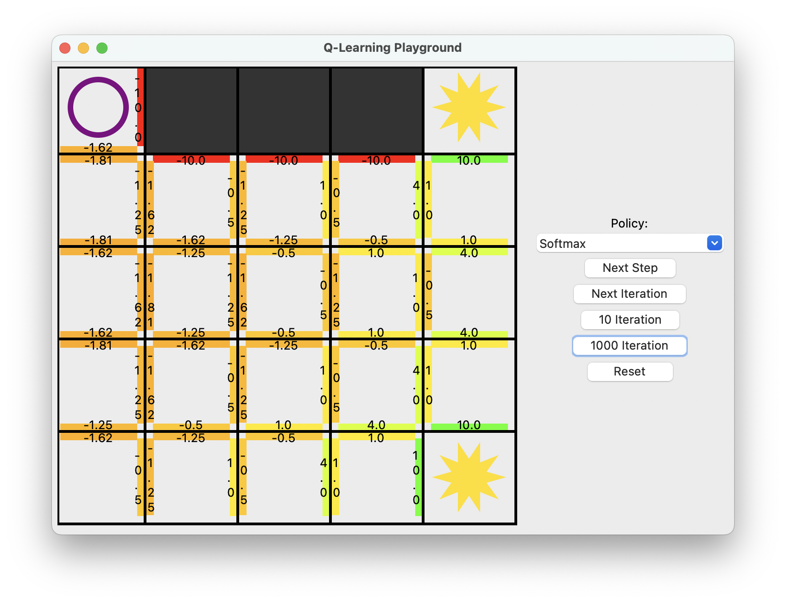

# QLearningPlayground
The program visualizes the learning process of the Q-Learning algorithm by allowing a step-by-step execution while showing the q-values. 

The level is inspired by the cliff problem. The goal of the agent is to get to one of the stars. The used rewards are as follows:
- (-1) for a step on an empty field
- (10) for reaching the goal
- (-10) for falling down the cliff (terminates the iteration)

## Questions to think about here:
- What star will be preferred by agent after training? The closer one which is next to the dangerous cliff or the safe but more distant one?
- What would happen if falling down the cliff would still terminate the iteration, but is not penalized by a negative reward?
- Is the reward of (-1) necessary or does it at least speed up the learning processs?

